<div align="center">

# 🛡️ Sentinel-X

**A production-grade Security Operations Center (SOC) platform**

Real-time event ingestion · Sigma-compatible detection engineering · Automated incident correlation · Threat-intel fusion · SOAR orchestration

[](https://github.com/TagoreNand/sentinel-x-upgraded/actions/workflows/ci.yml)


</div>

---

## Table of Contents

| Section | Description |
| --- | --- |
| [1. Overview](#1-overview) | What Sentinel-X is and what it does |
| [2. System Architecture](#2-system-architecture) | End-to-end component topology |
| [3. Detection Pipeline](#3-detection-pipeline) | The core event → incident flow |
| [4. Asynchronous Ingestion](#4-asynchronous-ingestion) | Queue, ledger, and crash recovery |
| [5. Access Control (RBAC)](#5-access-control-rbac) | Role hierarchy and capability gating |
| [6. Notification Fan-Out](#6-notification-fan-out) | Slack / webhook / email delivery |
| [7. Threat-Intel Feeds](#7-threat-intel-feeds) | STIX / TAXII / MISP ingestion |
| [8. Detection Engineering](#8-detection-engineering) | Sigma rule import and evaluation |
| [9. Data Model](#9-data-model) | Entity relationships |
| [10. Production Problems Solved](#10-production-problems-solved) | **The engineering substance** |
| [11. Verification & Evidence](#11-verification--evidence) | Real test, build, and runtime output |
| [12. Deployment](#12-deployment) | Docker, Kubernetes, CI/CD |
| [13. Getting Started](#13-getting-started) | Local development |
| [14. Project Structure](#14-project-structure) | Codebase map |
| [15. Limitations & Roadmap](#15-limitations--roadmap) | Honest boundaries |

---

## 1. Overview

Sentinel-X ingests security telemetry, normalizes it into a common event schema, enriches it with threat intelligence and asset context, evaluates it against Sigma-compatible detection rules, and correlates the results into deduplicated incidents that page responders in real time.

It is built as a **distributed system**, not a CRUD app: ingestion is decoupled from detection by a durable queue, incident creation is idempotent under concurrency, authorization is enforced by a totally-ordered role hierarchy, and every external integration degrades gracefully instead of failing the request.

### Core capabilities

| Domain | Capability |
| --- | --- |
| **Ingestion** | Raw log, syslog, and JSON event ingestion with async queue-backed processing |
| **Normalization** | Source-agnostic parsing into a unified event schema with severity/type inference |
| **Enrichment** | IOC matching, asset context, offline geo-classification, MITRE ATT&CK tagging, CVE candidates |
| **Detection** | Sigma-compatible rule engine with keyword, regex, threshold, and IOC-match logic |
| **Correlation** | Deterministic incident deduplication — an attack burst becomes *one* incident, not thousands |
| **Threat Intel** | STIX 2.x, TAXII 2.x, and MISP feed ingestion into the IOC store |
| **Response** | SOAR playbooks, notification fan-out (Slack / webhook / email), chain-of-custody forensics |
| **Governance** | 4-tier RBAC, full audit trail, admin user management |

### Technology stack

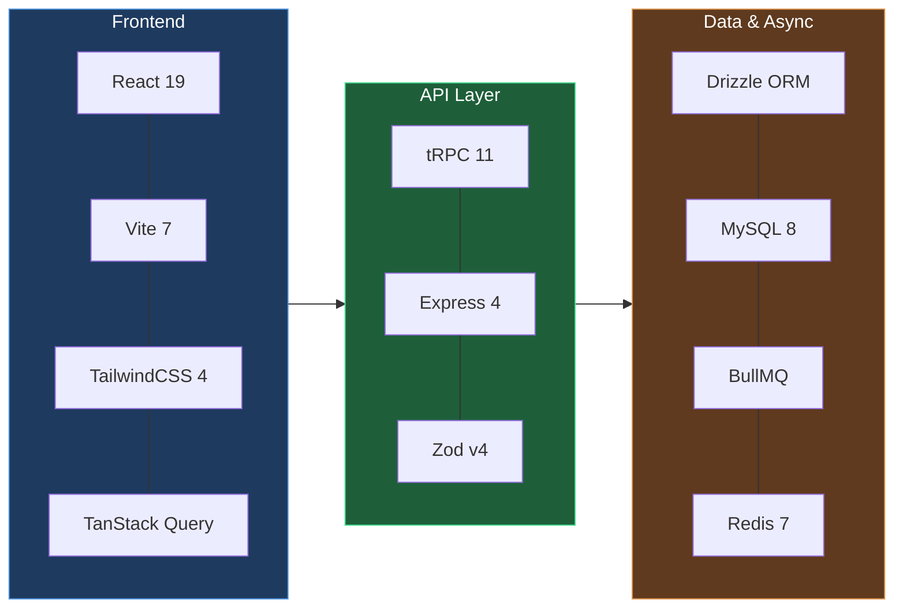

---

## 2. System Architecture

The platform separates the **synchronous request path** (fast, bounded) from the **asynchronous detection path** (expensive, queued). This is the single most important architectural decision: analysts and log shippers never wait on rule evaluation.

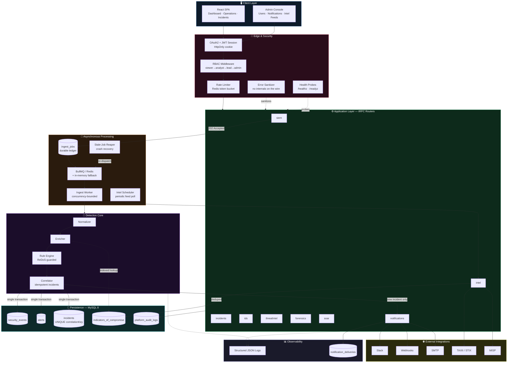

### Request path vs. detection path

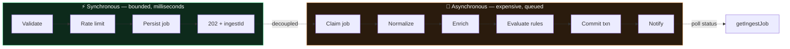

---

## 3. Detection Pipeline

The heart of the system: [`server/security/pipeline.ts`](server/security/pipeline.ts). Every stage is instrumented, every failure is typed, and the entire outcome commits atomically.

```mermaid
flowchart TD
    START(["Raw event<br/>syslog · JSON · raw"]) --> NORM

    subgraph S1["Stage 1 — Normalize"]
        NORM["Parse by source type"] --> INFER["Infer eventType,<br/>category, severity"]
        INFER --> VALIDATE{"Severity in<br/>allowed enum?"}
        VALIDATE -->|no| FALLBACK["Fall back to<br/>inferred severity"]
        VALIDATE -->|yes| EXTRACT
        FALLBACK --> EXTRACT["Extract IPs, ports,<br/>hostname, username"]
    end

    EXTRACT --> S2

    subgraph S2["Stage 2 — Enrich (indexed, bounded)"]
        IOC["IOC lookup<br/>exact IN() on index"]
        ASSET["Asset context<br/>hostname or FQDN prefix"]
        GEO["Offline geo<br/>public/private scope"]
        MITRE["ATT&CK technique<br/>+ tactic tagging"]
        CVE["CVE candidates<br/>only if asset has services"]
    end

    S2 --> S3

    subgraph S3["Stage 3 — Rule Evaluation"]
        LOAD["Load enabled rules"] --> PARSE{"Rule logic valid<br/>and constraining?"}
        PARSE -->|"invalid / vacuous"| SKIP["⛔ Skip rule<br/>fail closed + log"]
        PARSE -->|valid| MATCH["Evaluate conditions"]
        MATCH --> RX{"Regex<br/>condition?"}
        RX -->|yes| SAFE{"ReDoS-safe?"}
        SAFE -->|no| SKIP
        SAFE -->|yes| THRESH
        RX -->|no| THRESH{"Threshold rule?"}
        THRESH -->|yes| COUNT["SQL COUNT over<br/>composite index"]
        THRESH -->|no| SCORE
        COUNT --> SCORE["Confidence score"]
    end

    SCORE --> S4

    subgraph S4["Stage 4 — Atomic Persistence"]
        TXN["BEGIN TRANSACTION"] --> EV["INSERT security_event"]
        EV --> HIGH{"confidence ≥ 85<br/>or severity critical?"}
        HIGH -->|yes| KEY["Compute correlationKey<br/>sha256 rule+entity+bucket"]
        KEY --> UPSERT["INSERT ... ON DUPLICATE KEY<br/>UPDATE id=LAST_INSERT_ID(id)"]
        UPSERT --> NEW{"incidentId nanoid<br/>matches ours?"}
        NEW -->|yes| CREATED["🆕 New incident<br/>+ audit trail entry"]
        NEW -->|no| CORRELATED["🔗 Correlated into<br/>existing incident"]
        HIGH -->|no| ALERT
        CREATED --> ALERT["INSERT alert + detection"]
        CORRELATED --> ALERT
        ALERT --> COMMIT["COMMIT"]
    end

    COMMIT --> DEADLOCK{"Deadlock<br/>errno 1213/1205?"}
    DEADLOCK -->|yes| RETRY["Retry once<br/>same correlationKey"]
    RETRY --> TXN
    DEADLOCK -->|no| POST

    subgraph S5["Stage 5 — Post-Commit Side Effects"]
        POST["For each NEW incident"] --> NOTIFY["Fire-and-forget<br/>notification fan-out"]
    end

    NOTIFY --> DONE(["Result: event, alerts,<br/>detections, incidentIds"])

    style S1 fill:#0d1b2a,stroke:#4a90d9,color:#fff
    style S2 fill:#0d2a2a,stroke:#4ad9d9,color:#fff
    style S3 fill:#1b0d2a,stroke:#904ad9,color:#fff
    style S4 fill:#0d2a1b,stroke:#4ad98f,color:#fff
    style S5 fill:#2a1b0d,stroke:#d9904a,color:#fff
    style SKIP fill:#3a1010,stroke:#d94a4a,color:#fff
    style CREATED fill:#103a20,stroke:#4ad98f,color:#fff
    style CORRELATED fill:#3a3010,stroke:#d9d94a,color:#fff
```

### Why correlation matters — the incident-storm problem

Without idempotent correlation, an SSH brute-force spraying 5,000 events creates 5,000 incidents. The dashboard becomes unusable during an actual attack.

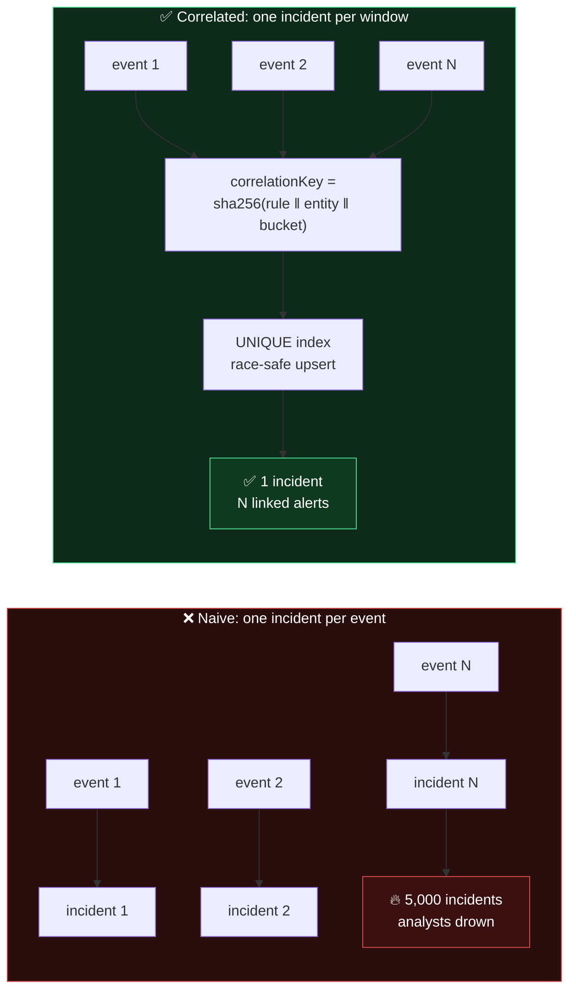

---

## 4. Asynchronous Ingestion

Ingestion is accept-fast and durable. The **ledger is the source of truth**; the queue is delivery-only. This means a lost Redis message, a crashed worker, or a restarted pod never loses an event.

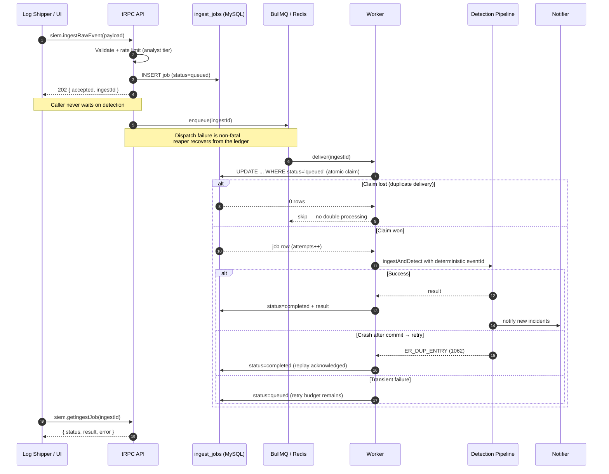

### Crash-recovery state machine

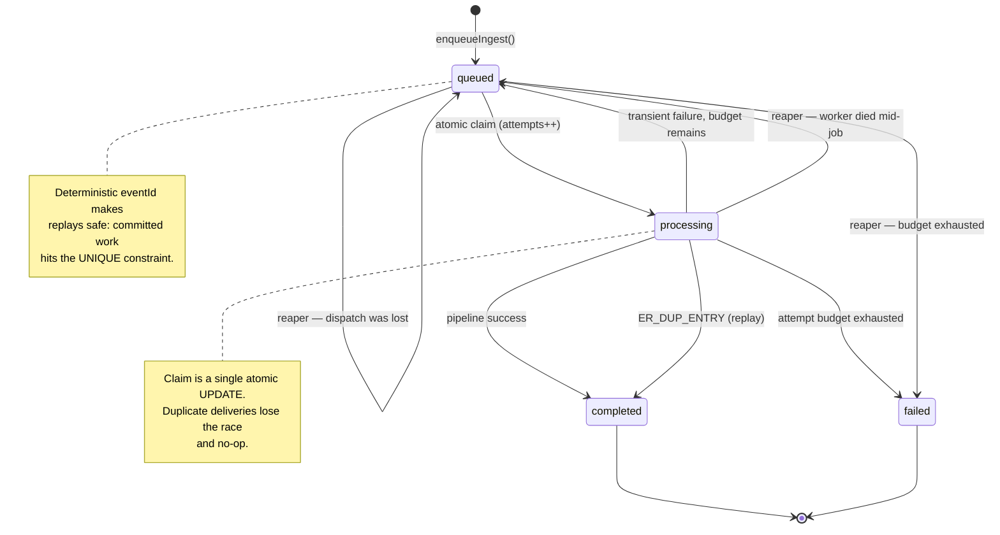

---

## 5. Access Control (RBAC)

Roles form a **totally ordered hierarchy**, so authorization is a single rank comparison. It is structurally impossible to grant a capability to a lower tier without also granting it to every tier above.

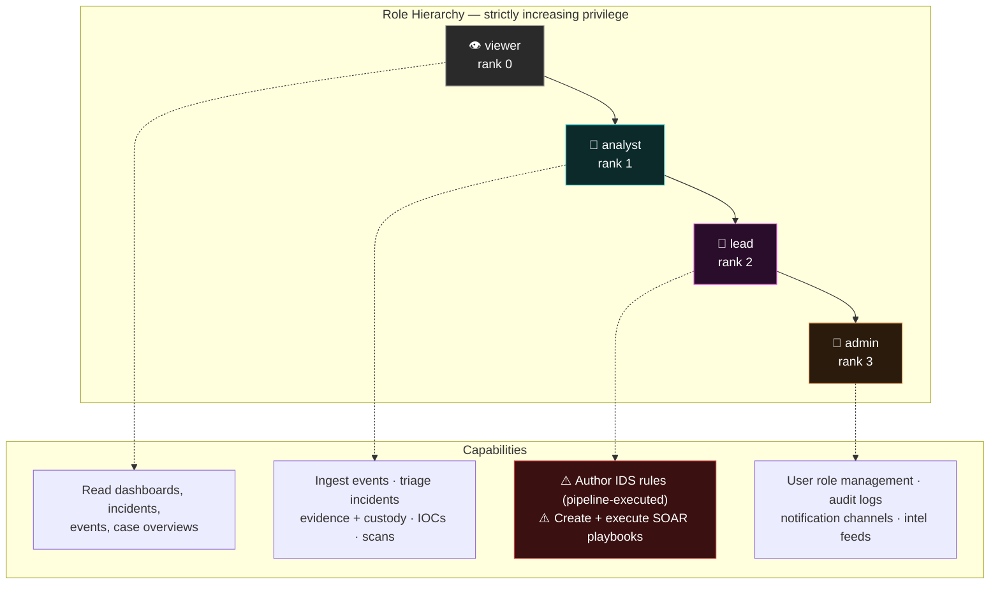

> **Why `lead` exists:** IDS rules contain regex and matching logic that the ingestion pipeline **executes against every event**, and SOAR playbooks fire automated response actions. These change what the platform *does*, not just what it records — so they sit above routine investigation work.

### Authorization decision flow

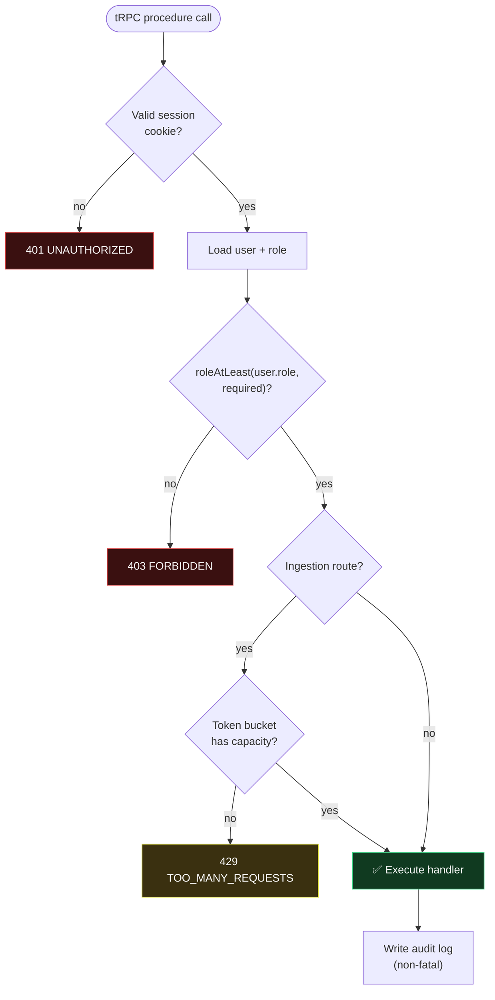

---

## 6. Notification Fan-Out

New incidents page responders through Slack, generic webhooks, or email. Dispatch is **best-effort and never fatal** — a notification failure cannot roll back incident creation.

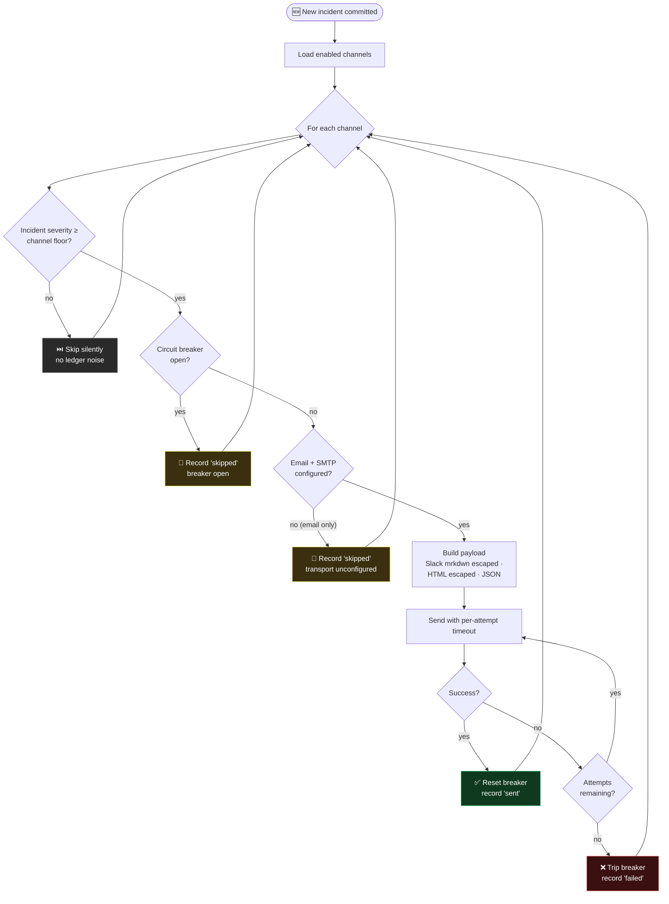

### Circuit breaker states

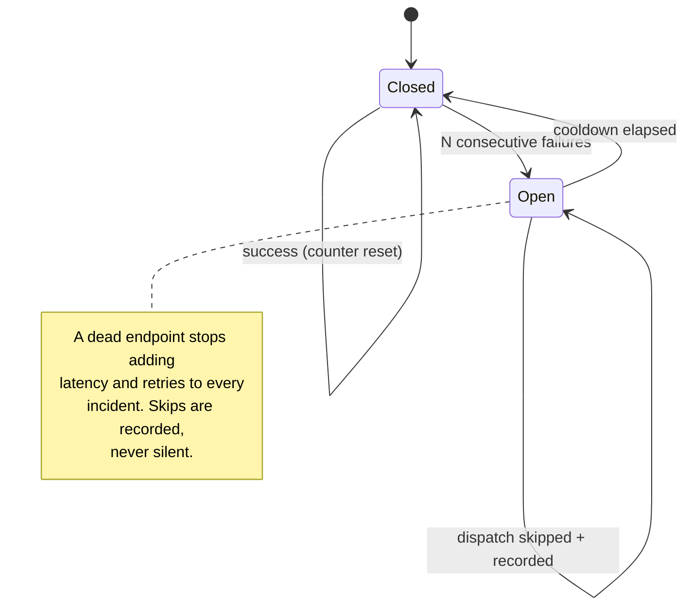

---

## 7. Threat-Intel Feeds

External indicators flow into the IOC store, where the pipeline's enrichment picks them up automatically.

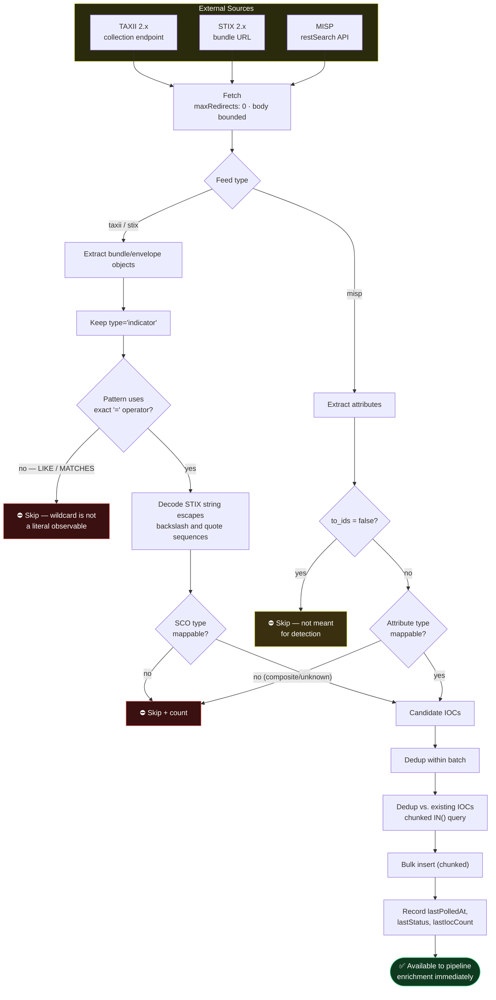

> **Fail-closed doctrine:** an indicator that cannot be translated faithfully is **skipped and counted**, never coerced. A false IOC poisons every future detection — a miss is strictly better than a wrong indicator.

---

## 8. Detection Engineering

Analysts can author rules directly or import community Sigma rulesets. The importer translates a documented subset and **rejects anything it cannot represent faithfully**.

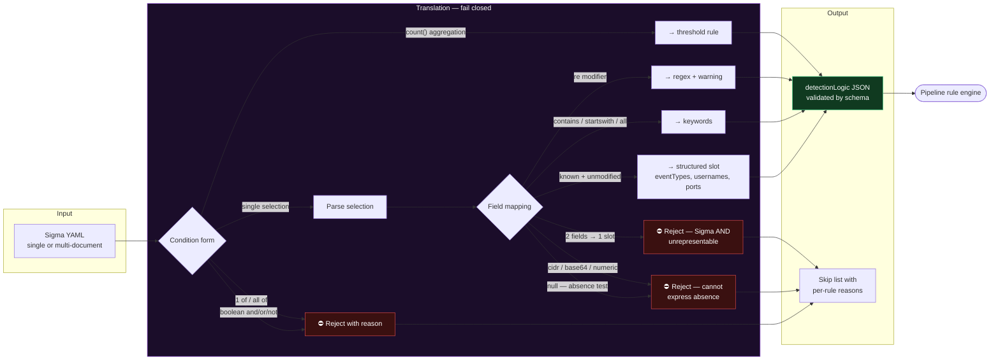

### Rule evaluation order (short-circuiting)


---

## 9. Data Model

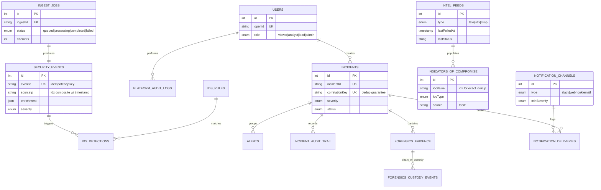

### Migration history

| Migration | Purpose |
| --- | --- |
| `0000` – `0002` | Base schema, security modules, major upgrade |
| `0003_pipeline_hardening` | `incidents.correlationKey` UNIQUE + composite indexes on `security_events` |
| `0004_ingest_queue` | `ingest_jobs` durable ledger |
| `0005_rbac_roles` | Three-phase role enum migration (`user` → `analyst`) |
| `0006_notifications` | `notification_channels` + `notification_deliveries` |
| `0007_intel_feeds` | `intel_feeds` with last-poll observability |

---

## 10. Production Problems Solved

This is the substance of the engineering work. Each item below was a real defect or architectural gap, identified through code audit and adversarial review, with a specific failure mode and a specific fix.

### 🔴 Data integrity & correctness

| # | Problem | Production impact | Resolution |
| --- | --- | --- | --- |
| 1 | **Broken primary-key extraction.** `db.insert()` returns a `[ResultSetHeader, FieldPacket[]]` tuple; code read `.insertId` off the tuple — always `undefined`. | Every alert shipped with **empty `sourceEvents`**; detections had null event links; custody events were never written; scan findings never linked to scans. Silent, repo-wide data-lineage corruption. | `$returningId()` across five helpers; verified by integration tests asserting real PKs. |
| 2 | **Incident storm.** No idempotency — every matching event created a *new* incident. | A 5,000-event brute-force produced 5,000 duplicate incidents during a real attack. Availability failure of the *analysts*. | Deterministic `correlationKey = sha256(rule ‖ entity ‖ time-bucket)` + **UNIQUE index** + atomic `INSERT … ON DUPLICATE KEY UPDATE id=LAST_INSERT_ID(id)`. |
| 3 | **Created-vs-correlated misclassification.** mysql2 negotiates `CLIENT_FOUND_ROWS` by default, so the duplicate path also reports `affectedRows = 1`. | Every correlated event wrote a duplicate *"Auto-created"* row into the user-visible incident audit trail. | Compare the persisted `incidentId` nanoid against the one this call attempted — immune to driver flags and timestamp precision. |
| 4 | **Silent data loss on auth.** `upsertUser` logged a warning and returned **success** when the DB was down. | A "logged-in" user with no user record — corruption of the identity source of truth. | `getDb()` throws a typed `DatabaseUnavailableError`; availability is an invariant, not a per-call policy. |
| 5 | **Destructive enum migration.** A direct narrowing `ALTER` coerces out-of-range enum values to `''`. | Every existing user's role silently blanked — total authorization corruption. | Three-phase migration: widen to a superset → remap `user` → `analyst` → narrow. Integration-tested against pre-migration rows. |
| 6 | **Non-atomic outcomes.** Event, alert, detection, and incident writes were independent. | A mid-sequence failure left orphaned alerts pointing at events that never persisted. | Single transaction for the entire detection outcome. |

### ⚡ Scalability & performance

| # | Problem | Production impact | Resolution |
| --- | --- | --- | --- |
| 7 | **Synchronous detection in the request path.** Enrichment, rule evaluation, and persistence ran inline. | Ingestion latency = detection cost. One slow rule set stalls every log shipper. | Queue-backed async ingestion: validate → durable ledger → `202 Accepted`; worker drains through the pipeline. |
| 8 | **O(table) work per event.** Every event loaded 500 IOCs, 300 events, all rules, and 500 CVEs into memory. | ~130k rows/sec of pointless transfer at 100 events/sec. | Exact indexed `IN()` IOC lookups; CVE fetch only when the asset declares services. |
| 9 | **Leading-wildcard `LIKE` on the hot path.** `LIKE '%value%'` cannot use an index. | Full table scan per ingested event against the IOC table. | Exact-match lookup for enrichment; the wildcard search is bounded and confined to the analyst UI path. |
| 10 | **In-memory threshold counting.** Threshold rules counted against a 300-row snapshot. | Under-counted during bursts — precisely when brute-force rules must fire. | SQL `COUNT` over new composite indexes `(sourceIp, timestamp)` / `(username, timestamp)`, evaluated on the transaction connection. |
| 11 | **No connection pooling.** Lazily-initialized singleton with zero pool configuration. | Unbounded connection queueing turns a slow database into unbounded memory growth. | Explicit `mysql2` pool with sized limits and a **bounded queue** — backpressure, not buffering. |
| 12 | **Per-pod rate limiting.** In-memory token bucket. | Effective limit multiplied by replica count — the fleet-wide budget was fiction. | Redis-backed token bucket evaluated atomically in a single Lua script; degrades to per-pod on Redis failure (never fails open). |

### 🛡️ Security & access control

| # | Problem | Production impact | Resolution |
| --- | --- | --- | --- |
| 13 | **Privilege escalation.** Any authenticated user could author IDS rules (regex the pipeline *executes*) and fire SOAR playbooks. | A low-privilege account could change platform behavior and trigger automated response. | 4-tier RBAC; rule authoring and SOAR gated to `lead`, governance to `admin`. |
| 14 | **ReDoS on the event loop.** Analyst-supplied rule regex compiled and executed unguarded. | One `(a+)+$` rule freezes the single Node process → liveness failure → total outage, triggered by a *rule edit*. | Length caps, catastrophic-backtracking screening, compile cache, bounded haystack. Seam documented for an RE2 swap. |
| 15 | **Fail-open rule matching.** A rule with empty logic matched *every* event. | Combined with auto-incident creation: a self-inflicted alert flood. | Vacuous and invalid rule logic is rejected — skipped and logged, never evaluated permissively. |
| 16 | **Internal error leakage.** Stack traces and SQL fragments returned to clients. | Reconnaissance gift on a security product. | Production `errorFormatter` emits only `AppError.safeMessage`; full diagnostics stay in the log stream. |
| 17 | **Fail-open rate limiter.** `Number("abc")` → `NaN`, and `NaN` passes both `< 1` and `<= 0` guards. | A config typo silently disabled rate limiting entirely. | `Number.isFinite` validation + an `envNumber()` helper that degrades to safe defaults with a warning. |
| 18 | **Placeholder secrets accepted at boot.** | A broken secret mount produced a Ready pod minting **unsigned sessions**. | `validateEnv()` refuses to boot in production on missing/short/placeholder `JWT_SECRET` or missing `DATABASE_URL`. |
| 19 | **Slack markdown injection.** Analyst-controlled incident titles reached Slack `mrkdwn` sinks unescaped. | `<!channel>` forced broadcast pings; `<http://evil\|Console>` spoofed links in the responders' trusted channel. | Escaped per Slack's rules; `plain_text` blocks deliberately left literal. |
| 20 | **Credentialed redirect following.** Intel feed fetches carry a Bearer/API token. | A `302` could ship the token to an internal or attacker-controlled host. | `maxRedirects: 0` plus response-body size bounds. |
| 21 | **Bypassable payload bound.** The 64 KB cap applied only to the string branch of a union. | The same bytes sent as a JSON object bypassed the limit entirely. | Serialized-size refinement on the object branch. |

### 🔧 Resilience & fault tolerance

| # | Problem | Production impact | Resolution |
| --- | --- | --- | --- |
| 22 | **Deadlock victims silently dropped.** Concurrent inserts on the same unique key deadlock; MySQL rolls back one. | The victim's **entire event** was lost, not just its incident link. | `isRetryableTxError` (errno 1213/1205) + one bounded retry that converges on the same correlation key. |
| 23 | **Hanging Redis limiter.** `maxRetriesPerRequest: null` + offline queue meant commands never settled. | Every ingest request hung during a Redis outage; the reaper guard wedged permanently. | Fail-fast producer connection (`enableOfflineQueue: false`, bounded retries, `commandTimeout`). |
| 24 | **Unbounded email dispatch.** nodemailer defaults are 30 s–10 min; fan-out is sequential. | One stalled SMTP relay held up the Slack page for the *same* incident. | Per-attempt timeout enforced for **every** transport, plus SMTP connection/greeting/socket timeouts. |
| 25 | **Side-door routes lied about failure.** IAM/endpoint/cloud/phishing committed their row, then ran detection; a throw reported "not recorded". | Clients retried and **duplicated** the domain row. | Detection is explicitly best-effort on those routes; surfaced as `detectionTriggered: false`. |
| 26 | **No crash recovery for queued work.** | A dispatch lost between INSERT and enqueue, or a worker crash mid-job, stranded events forever. | Stale-job reaper re-dispatches `queued`/`processing` rows past a deadline; deterministic `eventId` makes replays safe. |
| 27 | **Reaper could overwrite completed work.** No status guard between the stale SELECT and the failure UPDATE. | A slow-but-alive worker's committed job could be stamped `failed`, inviting duplicate resubmission. | `markIngestJobFailure` is guarded to non-terminal statuses. |
| 28 | **Shutdown raced the DB pool.** Waiting queue tasks kept starting during shutdown. | Late-started jobs hit a closing pool, burning attempts on healthy work. | `close()` honors a `closed` flag; ordered teardown: queue → limiter → pool. |

### 📊 Observability & operations

| # | Problem | Production impact | Resolution |
| --- | --- | --- | --- |
| 29 | **`console.warn` as observability.** | No structured queries, no correlation, no durations. 3 AM debugging by grep. | Zero-dependency structured JSON logger with child contexts, bound `pipelineId`, and stage timers. |
| 30 | **No health probes.** | Kubernetes could not tell "alive" from "ready"; traffic routed to pods with no database. | `/healthz` (liveness, dependency-free) and `/readyz` (readiness, bounded DB ping) — **deliberately decoupled** so a DB blip drains traffic instead of crash-looping the fleet. |
| 31 | **Port-hunting in production.** The server silently bound the next free port. | A pod that looks `Running` while the Service points at a port nobody listens on. | Fail-fast binding in production; port hunting remains a dev convenience. |
| 32 | **No graceful shutdown.** | SIGTERM killed in-flight requests and mid-transaction work. | Drain with a hard deadline, ordered resource teardown, `terminationGracePeriodSeconds` set above it. |
| 33 | **Audit writes could fail the request.** | An audit failure reported an error for an operation that already committed; retries double-applied it. | Audit is non-fatal and logged; the log stream is the backstop record. |
| 34 | **Silent feed failures.** | A misconfigured intel feed simply stopped producing indicators, invisibly. | `lastPolledAt` / `lastStatus` / `lastError` / `lastIocCount` per feed, surfaced in the admin UI. |
| 35 | **Root container, non-reproducible build.** The image ran `npm install` against a **pnpm** lockfile, as root, shipping the full source tree. | Non-reproducible dependencies and an oversized attack surface. | 4-stage build: frozen lockfile → prod-only deps → non-root user → `HEALTHCHECK`. |

---

## 11. Verification & Evidence

Every claim below is reproducible from this repository. The outputs are captured from actual runs.

### Static analysis

```console
$ pnpm run check
> tsc --noEmit
✓ No errors
```

Strict TypeScript across client, server, and shared code — no `any` escapes at module boundaries, no suppressed diagnostics.

### Unit test suite — 111 tests, 9 files

```console
$ pnpm test

 ✓ shared/roles.test.ts                        (8 tests)   10ms
 ✓ server/_core/configAndResilience.test.ts    (10 tests)  13ms
 ✓ server/queue/memoryChannel.test.ts          (7 tests)   207ms
 ✓ server/security/intel.test.ts               (18 tests)  16ms
 ✓ server/security/notifications.test.ts       (16 tests)  79ms
 ✓ server/security/pipeline.hardening.test.ts  (25 tests)  31ms
 ✓ server/security/sigma.test.ts               (24 tests)  76ms
 ✓ server/security/pipeline.test.ts            (2 tests)   6ms
 ✓ server/auth.logout.test.ts                  (1 test)    4ms

 Test Files  9 passed (9)
      Tests  111 passed (111)
   Duration  4.37s
```

**Coverage highlights** — these are regression locks on real defects:

| Suite | What it proves |
| --- | --- |
| `pipeline.hardening` | Severity validation, fail-closed rule logic, ReDoS rejection, correlation-key determinism, deadlock/duplicate error classification, token-bucket semantics |
| `sigma` | Every supported mapping **and every rejection path** — boolean conditions, `1 of`/`all of`, unsupported modifiers, `null` absence tests, alias bombs, bounds |
| `intel` | STIX pattern extraction, `LIKE` fail-closed, escape decoding, MISP type mapping, `to_ids` handling |
| `notifications` | Severity floors, circuit-breaker transitions, retry/timeout bounds, Slack mrkdwn escaping, stale-status regression |
| `roles` | Total ordering of the hierarchy and every role-assignment guard |
| `memoryChannel` | Concurrency bounds, backpressure, drain-on-close semantics |

### Integration test suite — 20 tests against real MySQL

```console
$ pnpm run test:integration        # Testcontainers, or INTEGRATION_DATABASE_URL

 ✓ server/db.integration.test.ts                     (8 tests)
 ✓ server/security/pipeline.integration.test.ts      (2 tests)
 ✓ server/security/notifications.integration.test.ts (2 tests)
 ✓ test/integration/migration.integration.test.ts    (4 tests)
 ✓ server/security/sigma.integration.test.ts         (1 test)
 · server/security/intel.integration.test.ts         (3 tests — CI-gated)

 Test Files  5 passed        Tests  17 passed
```

> The suite skips cleanly when neither Docker nor `INTEGRATION_DATABASE_URL` is available, so `pnpm test` never depends on Docker. The 17 tests above were verified locally against MySQL 8; the 3 intel-feed tests are exercised by the CI `integration` job, which is the authoritative gate.

These run against a **real, migrated MySQL 8** — via Testcontainers locally or a service container in CI — because the highest-value defects in this project were driver-semantics bugs that unit tests structurally cannot reach:

- A correlated burst produces **one incident and exactly one** "Auto-created" audit row (the `CLIENT_FOUND_ROWS` defect).
- `$returningId()` returns real primary keys and alerts link their source event.
- The atomic ingest-job claim: a duplicate delivery gets nothing.
- The `0005` role migration applied to **pre-existing legacy rows**: `user` → `analyst`, admins preserved, `user` rejected afterward.
- A Sigma rule imported end-to-end then **fires on a matching event**.
- A webhook notification delivered to a real local HTTP sink, with the delivery ledger asserted.

### Production build

```console
$ pnpm run build
✓ vite build — client bundle
✓ esbuild — dist/index.js
```

### Runtime — boot, probes, and fail-fast

Structured JSON on stdout, per Twelve-Factor:

```json
{"ts":"2026-07-20T09:09:32.821Z","level":"warn","msg":"config: REDIS_URL is not set — ingestion queue and rate limiting degrade to per-pod in-memory mode","service":"sentinel-x","component":"server"}
{"ts":"2026-07-20T09:09:32.867Z","level":"warn","msg":"ingest queue initialized in single-node memory mode — set REDIS_URL for durable, multi-replica delivery","service":"sentinel-x","component":"ingest-queue","mode":"memory","concurrency":4,"capacity":1000}
{"ts":"2026-07-20T09:09:32.896Z","level":"info","msg":"server listening","service":"sentinel-x","component":"server","port":3191,"env":"production"}
```

Health probes behave as designed — liveness independent of the database, readiness gated on it:

```console
$ curl -s -o /dev/null -w "%{http_code}" localhost:3000/healthz
200

$ curl -s -o /dev/null -w "%{http_code}" localhost:3000/readyz   # no database
503
```

Production **refuses to boot** on an invalid secret configuration:

```json
{"level":"error","msg":"config: JWT_SECRET is not set — sessions cannot be signed; provision it from the secret store"}
{"level":"error","msg":"config: DATABASE_URL is not set — persistence and readiness will fail"}
{"level":"error","msg":"fatal configuration errors — refusing to start"}
```
```console
$ echo $?
1
```

### Continuous integration

Both jobs run on every push to `main` and every pull request:

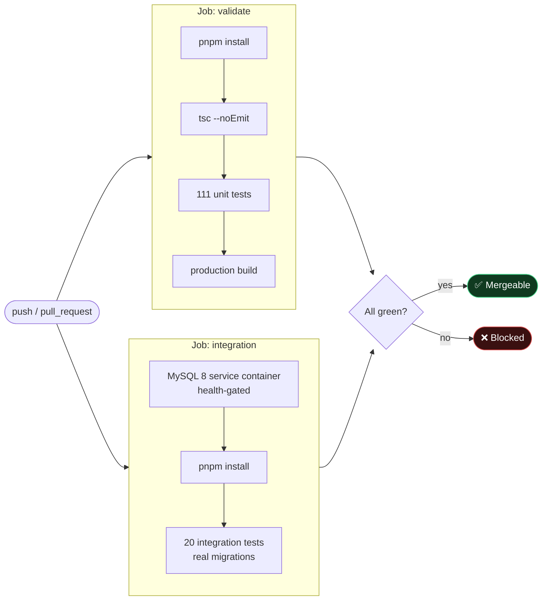

### Adversarial review process

Beyond automated tests, each milestone went through a structured multi-lens code review in which independent reviewers hunted for defects and **separate verifiers attempted to refute each finding**. Only findings that survived refutation were fixed. This process caught defects that tests and typechecking did not, including:

| Milestone | Confirmed findings fixed before merge |
| --- | --- |
| Pipeline hardening | `CLIENT_FOUND_ROWS` audit-trail duplication |
| Queue ingestion | Redis outage wedging the reaper; shutdown racing the pool; reaper overwriting completed jobs |
| Rate limiting | Zombie-connection hang bypassing the fallback; multi-second in-flight stalls |
| API surface | Bypassable payload bound; side-door routes misreporting failure; fail-open `NaN` config; masked not-found errors |
| Sigma importer | `Field: null` mistranslation; YAML alias-bomb crash; OR/AND slot merging |
| Notifications | Unbounded email timeout; Slack mrkdwn injection; stale status codes |
| Intel feeds | STIX `LIKE` wildcards stored as literal IOCs; undecoded escape sequences |

---

## 12. Deployment

### Container image

Multi-stage, reproducible, non-root:

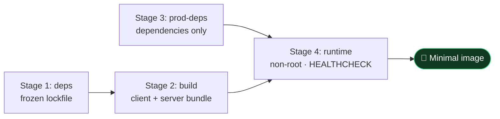

### Kubernetes topology

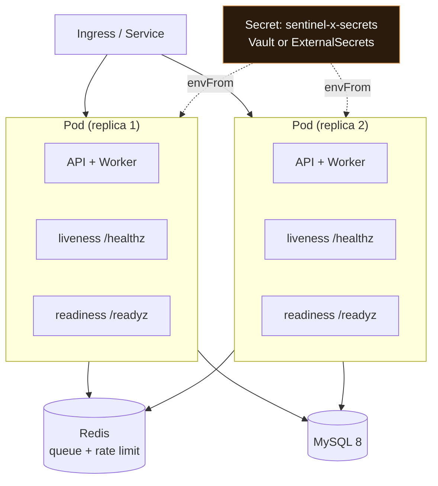

Manifest highlights ([`deploy/k8s.yaml`](deploy/k8s.yaml)):

| Setting | Rationale |
| --- | --- |
| `replicas: 2`, `maxUnavailable: 0` | One pod is not an availability strategy; deploys never dip below capacity |
| Split liveness / readiness | A DB blip drains traffic instead of crash-looping the fleet |
| `terminationGracePeriodSeconds: 30` | Exceeds the app's 10 s internal drain deadline |
| `readOnlyRootFilesystem`, `drop: ["ALL"]`, `runAsNonRoot` | Least privilege at the container boundary |
| `envFrom: secretRef` | Secrets from a managed store — never baked into the image |
| No CPU limit, memory limit set | Throttling a latency-sensitive API hurts more than it protects |

**Scaling note:** set `INGEST_WORKER_ENABLED=false` on API pods and run a separate worker Deployment to scale ingestion capacity independently of request capacity.

---

## 13. Getting Started

### Prerequisites

Node 22 · pnpm 10 · MySQL 8 · Redis 7 *(optional but recommended)*

### Quick start with Docker Compose

```bash
cp .env.example .env    # then set JWT_SECRET (openssl rand -base64 48)
docker compose up --build
```

Brings up MySQL, Redis, and the application together.

### Local development

```bash
pnpm install
cp .env.example .env
pnpm run db:push        # apply migrations 0000 → 0007
pnpm run dev            # http://localhost:3000
```

### Commands

| Command | Purpose |
| --- | --- |
| `pnpm run dev` | Development server with hot reload |
| `pnpm run check` | TypeScript strict typecheck |
| `pnpm test` | 111 unit tests (no Docker required) |
| `pnpm run test:integration` | 20 integration tests against real MySQL |
| `pnpm run build` | Production client + server bundles |
| `pnpm run db:push` | Generate and apply migrations |
| `pnpm run seed:demo` | Seed a demonstration dataset |

### Key configuration

| Variable | Default | Purpose |
| --- | --- | --- |
| `DATABASE_URL` | — | **Required.** MySQL connection string |
| `JWT_SECRET` | — | **Required in production.** ≥ 32 chars; boot fails on placeholders |
| `REDIS_URL` | — | Queue transport + fleet-wide rate limiting |
| `DEFAULT_NEW_USER_ROLE` | `analyst` | Role assigned on first login |
| `INGEST_RATE_BURST` / `_PER_SECOND` | `20` / `5` | Per-caller ingestion budget |
| `INGEST_WORKER_ENABLED` | `true` | Disable on API-only pods |
| `INTEL_POLL_INTERVAL_MINUTES` | `0` (off) | Automatic feed polling cadence |
| `SMTP_HOST` / `EMAIL_FROM` | — | Required for email notification channels |

See [`.env.example`](.env.example) for the complete, documented set.

### Demo workflow

1. Register asset `web-01.prod.internal` (Operations → Assets)
2. Add a malicious IOC for `91.240.118.12` (Threat Intel)
3. Import a Sigma rule or create an SSH brute-force rule (IDS — requires `lead`)
4. Ingest repeated syslog authentication failures (Operations → Ingestion)
5. Observe: enriched event → IDS detection → alert → **single correlated incident**
6. Execute a SOAR playbook against the incident
7. Attach evidence and record chain-of-custody events

---

## 14. Project Structure

```
sentinel-x/
├── client/src/
│   ├── pages/
│   │   ├── Dashboard.tsx              # SOC metrics overview
│   │   ├── OperationsPage.tsx         # Ingestion, IAM, endpoint, cloud, phishing, SOAR
│   │   ├── IncidentsPage.tsx          # Incident management
│   │   ├── Modules.tsx                # SIEM, Threat Intel, Vuln, IDS, Crypto, Honeypot
│   │   ├── AdminUsersPage.tsx         # Role management (admin)
│   │   ├── AdminNotificationsPage.tsx # Channels + delivery ledger (admin)
│   │   └── AdminIntelFeedsPage.tsx    # Feed configuration (admin)
│   └── _core/hooks/                   # useAuth, useRole
│
├── server/
│   ├── _core/
│   │   ├── index.ts                   # Bootstrap, probes, graceful shutdown
│   │   ├── trpc.ts                    # RBAC middleware, rate limiting, error sanitization
│   │   ├── env.ts                     # Config validation + safe numeric parsing
│   │   ├── logger.ts                  # Structured JSON logging
│   │   ├── errors.ts                  # Typed error taxonomy
│   │   ├── rateLimit.ts               # Token bucket + resilient composition
│   │   └── redisRateLimit.ts          # Fleet-wide Lua token bucket
│   ├── security/
│   │   ├── pipeline.ts                # ⭐ Detection pipeline core
│   │   ├── sigma.ts                   # Sigma rule translation
│   │   ├── intel.ts                   # STIX/TAXII/MISP ingestion
│   │   ├── notifications.ts           # Slack/webhook/email dispatch
│   │   ├── soar.ts · phishing.ts · vulnerability.ts
│   ├── queue/
│   │   ├── ingestQueue.ts             # BullMQ + ledger + reaper
│   │   └── memoryChannel.ts           # Bounded in-process fallback
│   ├── db.ts                          # Pool, typed queries, indexed lookups
│   └── routers.ts                     # tRPC API surface (19 namespaces)
│
├── shared/roles.ts                    # Role hierarchy + assignment policy
├── drizzle/                           # Schema + 8 migrations
├── test/integration/harness.ts        # Testcontainers + migration runner
├── deploy/k8s.yaml                    # Production manifest
└── .github/workflows/ci.yml           # validate + integration jobs
```

---

## 15. Limitations & Roadmap

Honest boundaries — this project states what it does *not* do as clearly as what it does.

### Current boundaries

| Area | Boundary |
| --- | --- |
| **Geo-IP** | Offline deterministic classification (public/private, coarse region), not a commercial feed |
| **Vulnerability scanning** | Evidence-driven (analyst-supplied service data) or explicitly labeled *simulation* — not a live network scanner |
| **SOAR actions** | Simulated and recorded, not destructive live response |
| **Regex engine** | JavaScript `RegExp` with backtracking screens; RE2 is the documented next step for a hard guarantee |
| **Sigma coverage** | A documented subset — boolean conditions and `1 of`/`all of` are rejected, not approximated |
| **Feed secrets** | Stored in the database; a hardened deployment should source them from the secret store |
| **CVE correlation** | JSON service matching; an `asset_service ↔ cve` join table is the planned replacement |

### Roadmap

- [ ] **Metrics & tracing** — Prometheus `/metrics` (ingestion latency histogram, incident counters, pool saturation) and OpenTelemetry spans across the queue hop
- [ ] **RE2 regex engine** — hard non-backtracking guarantee for analyst-supplied patterns
- [ ] **IOC unique constraint** — replace check-then-insert dedup in feed ingestion with a database-enforced constraint
- [ ] **Delivery/ledger retention** — partitioning or scheduled pruning for append-only tables
- [ ] **Multi-tenancy** — tenant isolation across all data access paths
- [ ] **Analyst hunting UI** — ad-hoc query interface over normalized events

### Repository state

The platform is developed in reviewed, CI-gated increments:

| Branch | Contents |
| --- | --- |
| `main` | Hardening overhaul, async queue, Redis rate limiting, RBAC, integration tests, Sigma importer |
| `feat/notification-hooks` | Notification fan-out (migration `0006`) |
| `feat/intel-feeds` | Threat-intel feeds (migration `0007`) — stacked on the above |

> **Merge order:** `feat/notification-hooks` → `feat/intel-feeds`, keeping migrations linear.
> **Before deploying:** apply migrations `0003` – `0007` *before* the new code boots.

---

<div align="center">

**Sentinel-X** · Built with production discipline: fail closed, fail loud, fail recoverably.

*Every architectural decision in this codebase is documented inline with the reasoning — not just what it does, but why it was done that way.*

</div>
